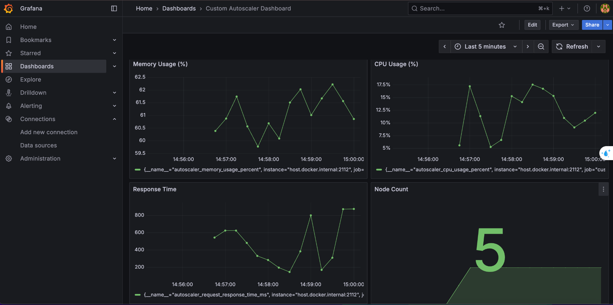

# 🚀 Custom Autoscaler (Go + Prometheus + Grafana)

A lightweight, educational **autoscaler simulator** written in Go — designed to mimic how a Kubernetes Cluster Autoscaler works, 
but simplified for local demonstration with **Prometheus metrics** and **Grafana dashboards**.

---

## 🌟 Features

- 🧠 **Multi-metric decision logic**: CPU, Memory, and Response Time (ms)
- ⚙️ **Dynamic scaling simulation** using a mock cloud provider
- 📊 **Prometheus integration** for metrics scraping
- 📈 **Grafana dashboard** for real-time visualization
- 🌐 **Optional REST API** to query and control scaling manually

---

## 🧩 Architecture Overview

```markdown
flowchart TD
    A[Autoscaler (Go)] -->|Expose /metrics| B[Prometheus]
    B -->|Scrape every 5s| A
    B --> C[Grafana Dashboard]
    A -->|REST API| D[User / External Tools]
```

---

## 🏗 Project Structure

```
custom-autoscaler/
├── cmd/
│   └── main.go
├── internal/
│   ├── autoscaler/
│   ├── metrics/
│   ├── cloud/
│   └── app/
├── grafana/
│   └── dashboards/autoscaler.json
├── prometheus/
│   └── prometheus.yml
├── docker-compose.yml
├── Dockerfile
├── Makefile
└── README.md
```

---

## 📊 Grafana Dashboard Preview



> The dashboard visualizes live metrics for **CPU Usage**, **Memory Usage**, **Response Time**, and **Node Count**.

---

## ⚙️ Configuration Example

```yaml
autoscaler:
  scale_up_cpu: 80
  scale_down_cpu: 30
  scale_up_mem: 85
  scale_down_mem: 40
  scale_up_resp_time: 400
  scale_down_resp_time: 150
  min_nodes: 1
  max_nodes: 10
  interval_seconds: 5
  cooldown_seconds: 20
  prometheus_port: 2112
  provider: mock
```

---

## 🧠 How It Works

1. Every interval, the autoscaler:
   - Collects system metrics (CPU, Memory, Response Time)
   - Evaluates the decision logic:
     ```go
     if CPU>80 || Mem>85 || RT>400 -> scale up
     if CPU<30 && Mem<40 && RT<150 -> scale down
     else no-op
     ```
   - Updates the node count in the mock cloud provider  
   - Exposes metrics to Prometheus via `/metrics`

2. Prometheus scrapes the metrics and Grafana visualizes them in real-time.

---

## 🖥 Running Locally

### **Prerequisites**
- Go ≥ **1.22**
- **Docker** and **Docker Compose** installed

---

### 🚀 **Option 1 — Run Autoscaler locally (Go only)**

```bash
make run
```
Runs the autoscaler directly using Go (no Docker).  
Metrics are available at:  
[http://localhost:2112/metrics](http://localhost:2112/metrics)

---

### 🐳 **Option 2 — Run full monitoring stack (Docker Compose)**

```bash
make up
```
Launches the **full stack** including:
- 🧠 **Custom Autoscaler** (Go service)
- 📊 **Prometheus** (metrics collection)
- 📈 **Grafana** (visualization)

Once running, access:

| Service | URL | Description |
|----------|-----|-------------|
| Autoscaler | [http://localhost:2112/metrics](http://localhost:2112/metrics) | Prometheus metrics |
| Prometheus | [http://localhost:9090](http://localhost:9090) | Query and inspect metrics |
| Grafana | [http://localhost:3000](http://localhost:3000) | Dashboard *(login: admin / admin)* |

---

### 🧰 **Other Make Commands**

| Command | Description |
|----------|-------------|
| `make build` | Build Go binary locally |
| `make docker-build` | Build Docker image manually |
| `make logs` | View container logs |
| `make down` | Stop all running containers |
| `make clean` | Remove all containers, volumes, and build artifacts |

---

## 📊 Metrics Exposed

| Metric | Description | Type |
|---------|-------------|------|
| `autoscaler_cpu_usage_percent` | Current CPU usage (%) | Gauge |
| `autoscaler_memory_usage_percent` | Current memory usage (%) | Gauge |
| `autoscaler_request_response_time_ms` | Average response time (ms) | Gauge |
| `autoscaler_node_count` | Number of active nodes | Gauge |
| `autoscaler_last_action` | Scale-up / scale-down / no-op | GaugeVec |

---

## 📦 Example Output

```
[ENGINE] Trigger scale-up | CPU=82.33% | MEM=69.10% | RT=435.22ms | Nodes=3
[AUTOSCALER] CPU=82.33 | MEM=69.10 | RT=435.22 | Nodes=3 | Action=scale-up
📊 Prometheus metrics server running at http://localhost:2112/metrics
```

---

## 🪪 License

MIT © 2025  
Developed by Hao Pham
